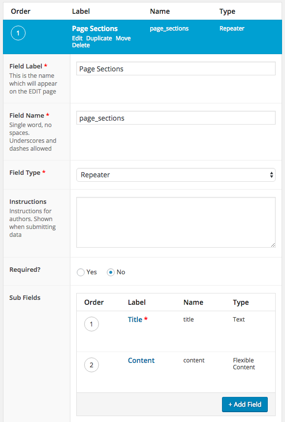
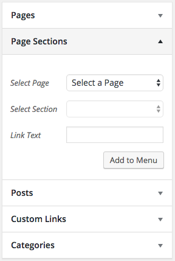
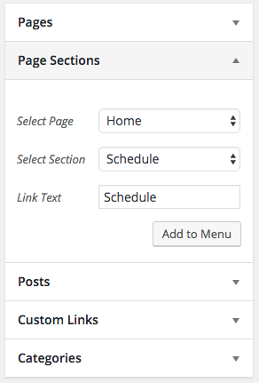
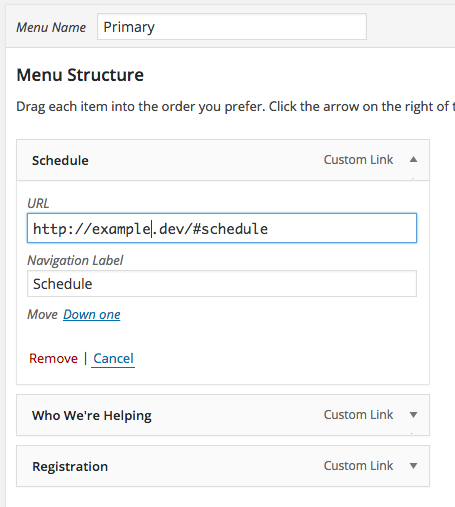

# WP Nav Helper - Page Sections

This plugin is designed to work with Advanced Custom Fields. It will allow you to select a page and then create links to a section on that page, assuming that page has ACF meta that follows a certain schema:

1. There's a field with a Field Name of `page_sections` that is a Repeater field.
1. `page_sections` Repeater field has any number of fields, one of them having a Field Name of `title`.

The plugin will create a link that includes a sanitized copy of the title. The title is passed through WordPress' `sanitize_title` function. The link will include the url of the page, so you can link to other pages.

You will also need to add that id property to the section on the page. Let's use this loop for an example:

```php
<?php
// check if the repeater field has rows of data
if( have_rows('page_sections') ):

 	// loop through the rows of data
    while ( have_rows('page_sections') ) : the_row();

$title_slug = sanitize_title(get_sub_field('title'));
?>
<section class="page-section section-<?php echo $title_slug; ?>" id="<?php echo $title_slug; ?>">
</section> <!-- end .page-section.section-<?php echo $title_slug; ?> -->
<?php
    endwhile;

endif;
?>
```

## Screenshots

### ACF Field Group


### Nav Helper in action



